## Part 1. Готовый докер

##### Взять официальный докер образ с nginx и выкачать его при помощи `docker pull`

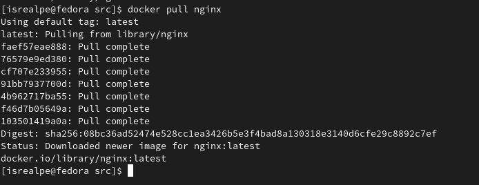

##### Проверить наличие докер образа через `docker images`

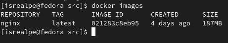

##### Запустить докер образ через `docker run -d [image_id|repository]`

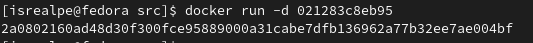

##### Проверить, что образ запустился через `docker ps`

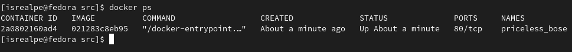

##### Посмотреть информацию о контейнере через `docker inspect [container_id|container_name]` (выдает JSON массив). По выводу команды определить и поместить в отчёт размер контейнера, список замапленных портов и ip контейнера

`-` Размер контейнера

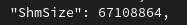

`-` Список замапленных портов

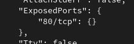

`-` IP контейнера 

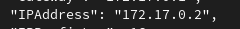

##### Остановить докер образ через `docker stop [container_id|container_name]`

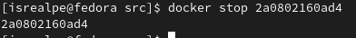

##### Проверить, что образ остановился через `docker ps`

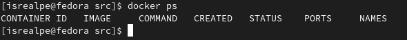

##### Запустить докер с портами 80 и 443 в контейнере, замапленными на такие же порты на локальной машине, через команду run (т.е. нужно сопоставить порт 80 в докере и порт 80 на локальной машине (аналогично с 443))

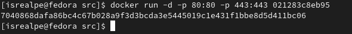

-p - проброс портов. Сначала указывается порт на локальной машине, потом на контейнере
-d - запускает контейнер в фоне. Без этого аргумента консоль будет ждать, когда контейнер остановится

*Если появляется ошибка о том, что порт уже где-то используется, то можно проделать следующие шаги:*

*`-` `$ sudo lsof -i -P -n | grep 80` - смотрим, что еще висит на этом порте (80 в данном случае), получаем pid*

*`-` `$ kill -9 <PID>` - удаляем этот процесс*

##### Перезапустить докер контейнер через `docker restart [container_id|container_name]`

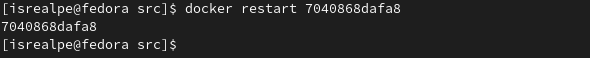

##### Проверить любым способом, что контейнер запустился

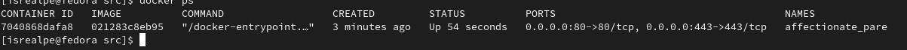

##### Проверить, что в браузере по адресу localhost:80 доступна стартовая страница nginx

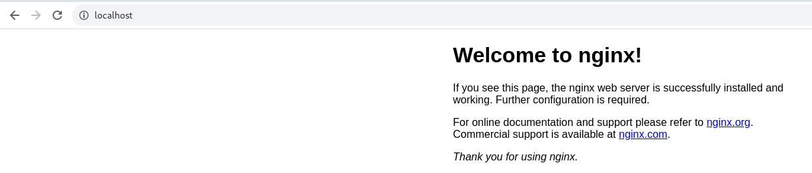
