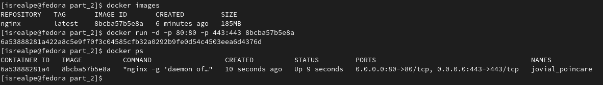

## Part 2. Операции с контейнером

##### Прочитать конфигурационный файл nginx.conf внутри докер контейнера через команду exec

##### Создать на локальной машине файл nginx.conf. Настроить в нем по пути /status отдачу страницы статуса сервера nginx

##### Скопировать созданный файл nginx.conf внутрь докер образа через команду `docker cp`

##### Перезапустить nginx внутри докер образа через команду exec

##### Проверить, что по адресу `localhost:80/status` отдается страничка со статусом сервера nginx

##### Экспортировать контейнер в файл container.tar через команду export

`$ docker export 7040868dafa8 > container.tar`

(7040868dafa8 - container id)

##### Остановить контейнер

##### Удалить образ через `docker rmi [image_id|repository]`, не удаляя перед этим контейнеры

##### Удалить остановленный контейнер

##### Импортировать контейнер обратно через команду import

`-c` - применить инструкцию Dockerfile к созданному образу
`CMD` указывает, какую команду запускать в контейнере

##### Запустить импортированный контейнер

##### Проверить, что по адресу localhost:80/status отдается страничка со статусом сервера nginx

