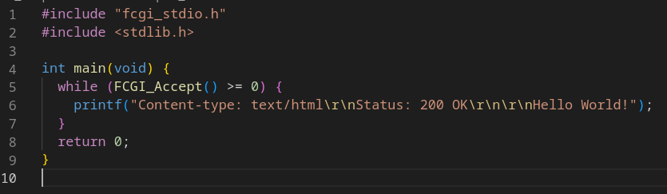
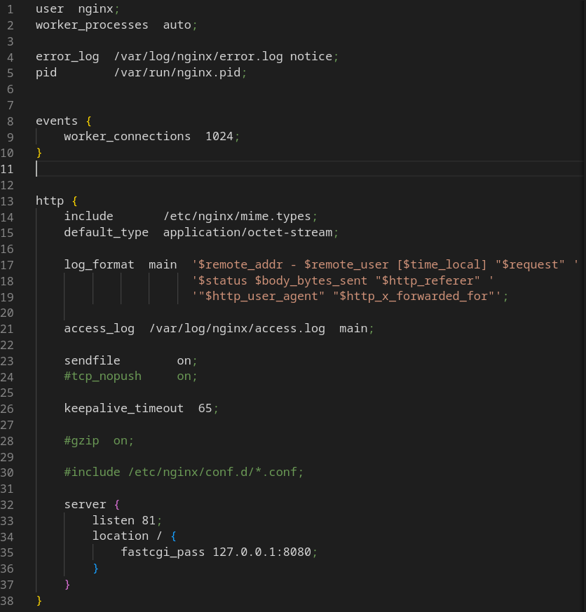
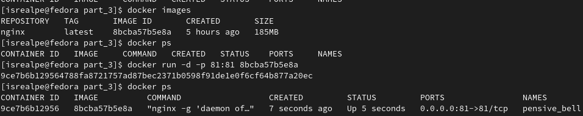
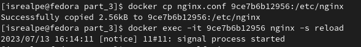
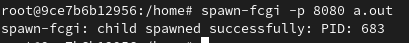
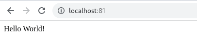

## Part 3. Мини веб-сервер

##### Написать мини сервер на C и FastCgi, который будет возвращать простейшую страничку с надписью Hello World!

*Функция `FCGI_Accept()` дает доступ новому запросу из HTML сервиса и создает CGI-совместимую среду выполнения для запроса*

*Заголовок `Content-Type` используется для указания исходного media-type ресурса (до любого кодирования содержимого, применяемого для отправки).*
*`Content-Type = "Content-Type:" media-type NL`*

*`media-type` — это строка, отправляемая вместе с файлом, указывающая тип файла (описывающий формат содержимого, например, звуковой файл может быть помечен как audio/ogg, или файл изображения image/png)*

*`text/html` сообщает о том, что нам нужет медиа-тип текст*

*`\r` - перенос каретки в начало строки*

##### Написать свой nginx.conf, который будет проксировать все запросы с 81 порта на 127.0.0.1:8080

*`fastcgi_pass` задаёт адрес FastCGI-сервера. Адрес может быть указан в виде доменного имени IP-адреса и порта*

##### Запустить написанный мини сервер через spawn-fcgi на порту 8080

Для работы нужен контейнер с портом 81, который замаплен на такой же порт на локальной машине

Далее нужно скопировать новый nginx.conf в /etc/nginx и перезапустить его

Скопируем программу для запуска сервера, чтобы запустить его из контейнера

`$ docker cp ../server/server.c 9ce7b6b12956:/home`

Далее проще подключиться к контейнеру с провами root и проделывать все необходимые манипуляции

`$ docker exec -it --user root 9ce7b6b12956 /bin/bash`

Для запуска server.c через apt-get нужно установить gcc, spawn-fcgi и libfcgi-dev

`$ apt-get install gcc`

`$ apt-get install spawn-fcgi`

`$ apt-get install libfcgi-dev`

Компиляция server.c

`$ gcc server.c -lfcgi`

Запуск fcgi сервера на порту 8080

*`spawn-fcgi` используется для запуска удаленных и локальных FastCGI процессов.*

##### Проверить, что в браузере по localhost:81 отдается написанная вами страничка

##### Положить файл nginx.conf по пути ./nginx/nginx.conf (это понадобится позже)