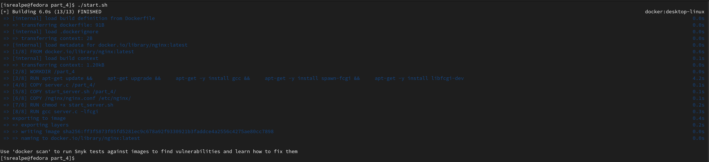

## Part 4. Свой докер

#### Написать свой докер образ, который:
##### 1) собирает исходники мини сервера на FastCgi из Части 3
##### 2) запускает его на 8080 порту
##### 3) копирует внутрь образа написанный ./nginx/nginx.conf
##### 4) запускает nginx.

nginx можно установить внутрь докера самостоятельно, а можно воспользоваться готовым образом с nginx'ом, как базовым.

##### Собрать написанный докер образ через docker build при этом указав имя и тег

##### Проверить через docker images, что все собралось корректно

##### Запустить собранный докер образ с маппингом 81 порта на 80 на локальной машине и маппингом папки ./nginx внутрь контейнера по адресу, где лежат конфигурационные файлы nginx'а (см. Часть 2). Проверить, что по localhost:80 доступна страничка написанного мини сервера

##### Дописать в ./nginx/nginx.conf проксирование странички /status, по которой надо отдавать статус сервера nginx

##### Перезапустить докер образ
Если всё сделано верно, то, после сохранения файла и перезапуска контейнера, конфигурационный файл внутри докер образа должен обновиться самостоятельно без лишних действий

##### Проверить, что теперь по localhost:80/status отдается страничка со статусом nginx

