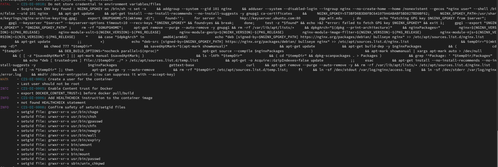
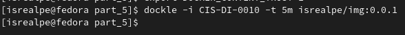

## Part 5. Dockle

##### Просканировать образ из предыдущего задания через `dockle [image_id|repository]`

##### Исправить образ так, чтобы при проверке через dockle не было ошибок и предупреждений

Для того, чтобы все работало, понадобилось запушить образ в докер хаб, иначе докля не могла его найти и выдавала ошибку